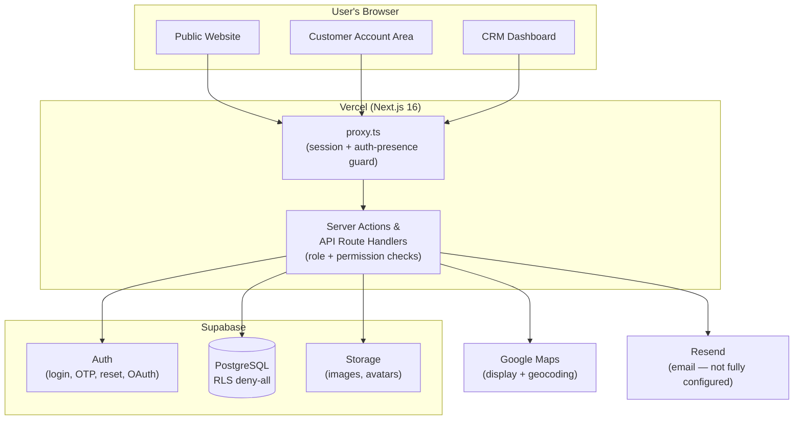
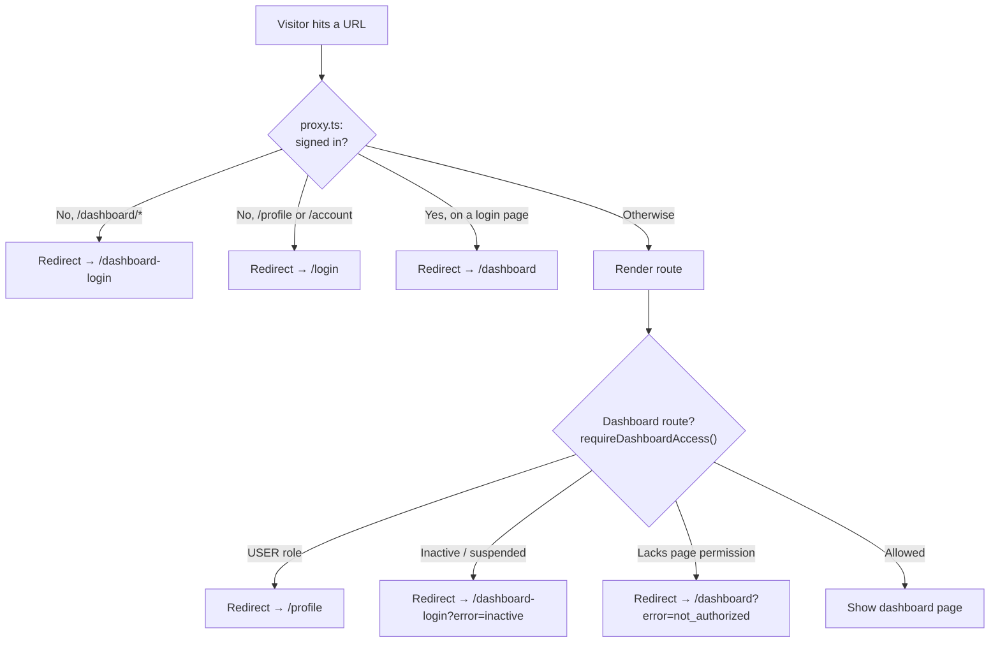
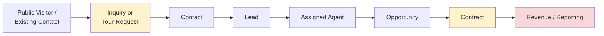
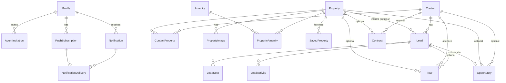
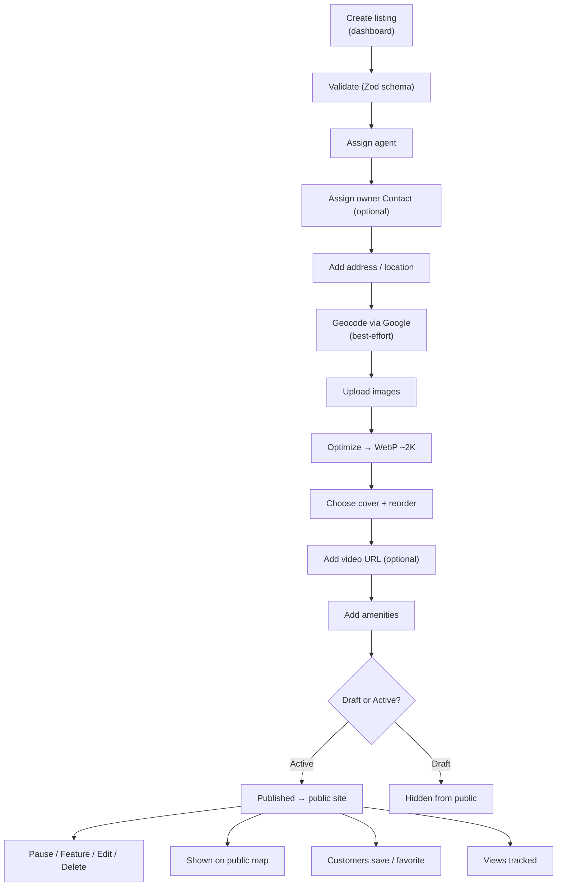
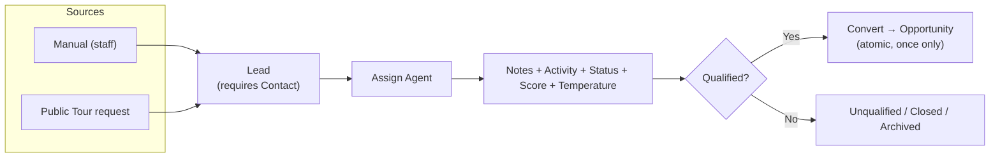

# Ulrich Propiedades — Current System Flow, Role Access and Implementation Plan

> **Purpose of this document**
> This is a shared reference between the development team and the client. It explains, in plain language, how the platform works today, what has already been built and tested, what is ready for the client to test, what is still in progress, and how the remaining pieces will connect.
>
> Everything below was verified directly against the current source code (database schema, migrations, API routes, server actions, Supabase configuration, role/permission helpers, data hooks, stores, layouts, and the request proxy) — **not** from screenshots or older notes. Where the code and earlier expectations disagree, the disagreement is called out openly as a *clarification*, never as a fault of either side.
>
> **How to read the status labels** used throughout:
> | Label | Meaning |
> |---|---|
> | ✅ **Live** | Built and connected to the real database; ready to test |
> | 🟡 **Partial** | Backend works but some UI/wiring or edge cases remain |
> | 🎨 **UI-only** | The screen exists and looks complete, but it shows sample data and is not yet connected to the database |
> | ⛔ **Blocked** | Code is ready; waiting on an external credential, a domain, or a client decision |
> | 🔜 **Planned** | Not started yet; scheduled for a later milestone |

---

## 1. Executive summary

Ulrich Propiedades is one platform made of three connected areas:

1. **Public website** — what visitors see: homepage, property listings, single-property pages, search & filters, About, Contact, FAQ, Privacy, Terms, and a Blog section.
2. **Customer account area** — where a registered visitor manages their own profile, saved/favorite properties, and their scheduled tours.
3. **Internal CRM dashboard** — where the agency's staff manage listings, contacts, leads, opportunities, contracts, agents, notifications, and settings.

**Technology used (verified in the codebase):**

* **Next.js 16** (App Router) is the application framework for all three areas. *Note: this version renames the traditional middleware file to `proxy.ts`, which the project uses.*
* **Supabase** provides authentication, the **PostgreSQL** database, **Row Level Security (RLS)**, and **file storage**.
* **Prisma 7** manages the database schema and all migrations (the schema is the single source of truth for the data model).
* **TanStack Query** manages server data on the screens: fetching, caching, loading states, and refreshing data after changes.
* **Zustand** is used only for small pieces of local screen state (filters, modals, the dashboard date range, user preferences) — never as the source of business data.
* **Vercel** hosts the application. *(Deployment mechanism — see the clarification in §2 and §18.)*
* **Google Maps** is the selected map provider (maps display + address geocoding).
* **Resend** is the selected provider for transactional email but is **not fully configured yet** (see §14).

**Security model worth highlighting up front:** every database table is locked down with Row Level Security set to *deny-all* for direct client access. Nothing reads or writes the database directly from the browser. All data flows through server code that first checks the user's role and permissions. This is a deliberate, defense-in-depth choice and it is already in place across the CRM.

---

## 2. Current milestone status

> **Deployment clarification (please confirm):** The project brief describes Vercel deployments as "automatically connected to GitHub." In the current source, the code **is** version-controlled in a GitHub repository (`mobiprop/Ulrichpropiedades`), but the actual deployments are performed by a **direct Vercel CLI upload** (`pnpm deploy`, see `scripts/deploy.sh`, which states "no GitHub connection needed"). Both approaches are valid. If the client prefers automatic GitHub→Vercel deployments, that can be connected; today it is a manual CLI deploy. This is a small process detail, surfaced here only to keep expectations aligned.

### Milestone 1 — Public Website Core + Listings Foundation

**Scope:** Homepage, header/footer, About, Contact, FAQ, Privacy Policy, Terms & Conditions, responsive layouts, Listings page, single listing page, search & filters, dynamic navigation, Google Maps foundation, database-connected property data.

**Status: ✅ Ready for client testing.**

* The public Listings page and single-listing page are connected to the real database (`listPublicListings`, `getPublicListingBySlug`). Listings created/published in the dashboard appear on the public site.
* Search, filters, and location autocomplete are live (location suggestions come from real active listings).
* The single-listing page and listing cards display a **live Google Map** with a marker at the property's coordinates.
* **Known refinements found in the current source (Milestone-1 scope):**
  * **Contact page form is UI-only.** The Contact page renders a name/email/message form, but it has no submit handler — it does not yet send an email or create any record. (See §17.)
  * **Contact page map is a static image,** not a live Google Map (`map.webp` from storage). The live-map provider is already integrated elsewhere, so swapping this in is a small task. (See §15.)
  * The **Blog** section is presentation-only with sample posts (no blog database yet). It is included visually in Milestone 1 but its content management is a later decision (see §18).

> These are genuine, small Milestone-1 finishing items — not later-milestone features. They are listed honestly so testing expectations are correct.

### Milestone 2 — Property Management System + Authentication

**Scope:** User registration & login, OTP & password reset, role-based permissions, staff login, dashboard foundation, property creation/editing, image upload & optimization, listing statuses, agent assignment, dashboard property search, media management, public/dashboard listing synchronization.

**Status: ✅ Ready for client testing — except transactional email delivery (⛔ blocked, see §14).**

* The full application logic is implemented and working: registration, login, OTP verification, password reset, OAuth (Google/Facebook), staff login, and the staff invitation/acceptance flow are all coded.
* Property management is fully live: create, edit, status changes, feature/unfeature, agent assignment, dashboard search, and the complete image pipeline (WebP conversion at ~2K, cover selection, reorder, remove). Public and dashboard listings stay in sync through the shared database.
* **The one blocker is email *delivery*, not application logic.** Registration OTP, password-reset emails, and staff-invitation emails are all coded, but the actual sending depends on Resend being fully configured (verified sending domain + sender address) and, for sign-up/reset specifically, on the Supabase Auth email settings. Once those credentials and the domain verification are provided, the remaining email integration is roughly **one working day plus testing**.
* Please read §14 carefully — it separates "application bug" from "missing external email configuration," because the often-reported *"registration appears stuck"* symptom is caused by email delivery limits, not by broken registration code.

### Milestone 3 — CRM Modules

**Scope:** Agents, Contacts, Leads, Opportunities, Contracts, Notifications, Dashboard metrics, Reporting widgets, Agent profiles, Activity history, Revenue tracking, Role-based visibility.

**Status: 🟡 In progress.** Module-by-module classification:

| Module | Status | Notes |
|---|---|---|
| **Agents** | ✅ Live | List, profile detail with **real** deal/revenue stats, activate/deactivate, delete, invitations |
| **Contacts** | ✅ Live (with gaps) | Create/edit/soft-delete/search/metrics live; **no duplicate detection** on manual create; **no dedicated detail *page*** yet |
| **Leads** | ✅ Live | Full CRM: create, notes, activity history, assign, archive/restore, **convert → Opportunity**, metrics, role scoping |
| **Opportunities** | ✅ Live (no delete) | List/create/update connected to real data + metrics; created manually or by lead conversion |
| **Contracts** | ✅ Live (no delete) | List/create/update connected to real data + metrics; **created manually only** (not auto-generated from a won opportunity) |
| **Notifications** | 🟡 Partial | In-app + browser push live for invitations, listings, lead-assignment, tour events; opportunity/contract/lead-created events and contract-expiry reminders **not yet triggered** |
| **Dashboard overview metrics / reporting widgets** | 🎨 UI-only | The dashboard home cards, revenue chart, locations panel, and sales table currently show **sample data** (see §12) |
| **Activity history** | ✅ Live | Audit logs + per-lead activity feeds are recorded for real actions |
| **Revenue tracking** | 🟡 Partial | Real per-agent revenue is computed on the Agent profile; company-wide revenue on the dashboard home is still sample data |
| **Role-based visibility** | ✅ Live | Centralized permission map drives sidebar, route guards, and server-side checks |

> **Client decision required (see §11 & §18):** Opportunities and Contracts are currently built as **two separate modules** (separate tables, pages, statuses, and permissions). Before we go deeper, we need the client to confirm whether they should **stay separate (Option A)** or be **combined into one "Deal" workflow (Option B)**. We will not finalize their database structure until this is confirmed.

### Milestone 4 — Integrations, Messaging, QA and Launch

**Scope:** Messaging inbox, scheduled tours, HTML email templates, Google Calendar integration, Mailchimp, global search, activity logs, bug fixing, performance optimization, production deployment, documentation, final handoff.

**Status: 🔜 Future milestone — with several pieces already implemented ahead of schedule:**

| Item | Status |
|---|---|
| **Global search** (⌘K across the dashboard) | ✅ Implemented ahead of schedule |
| **Activity logs** | ✅ Implemented ahead of schedule |
| **Scheduled tours** | ✅ Implemented ahead of schedule (public request → records created + agent notified; customer "My Tours" area exists) |
| **Browser push notifications** | ✅ Implemented ahead of schedule (web-push/VAPID) |
| **Messaging inbox** | 🎨 UI-only (no message database yet) |
| **HTML email templates** | 🟡 One branded invitation template exists; a reusable base template is planned |
| **Google Calendar integration** | 🔜 Planned |
| **Mailchimp** | 🔜 Planned |
| **Performance / QA / handoff** | 🔜 Planned |

> The presence of an early Milestone-4 feature does **not** mean Milestone 4 is complete. Each is marked individually.

---

## 3. Platform areas and user entry points

All routes below are the **actual paths in the current codebase**.

| Area | Route(s) | Notes |
|---|---|---|
| **Public website** | `/`, `/about`, `/contact`, `/faq`, `/privacy-policy`, `/terms-conditions`, `/listings`, `/listings/[slug]`, `/blog`, `/blog/[slug]` | Open to everyone |
| **Public login / register** | `/login`, `/register` | Email/password + Google/Facebook |
| **OTP verification** | `/verify-otp` | Sign-up confirmation code |
| **Password reset** | `/reset-password` → `/new-password` → `/reset-success`, `/password-reset-success` | Email-driven |
| **Customer account area** | `/profile`, `/saved-listings`, scheduled-tours ("My Tours") | Signed-in customers (USER role) |
| **Staff dashboard login** | `/dashboard-login` | Dedicated staff entry |
| **Internal CRM dashboard** | `/dashboard` + `/dashboard/{agents, agents/[id], agents/invitations, contacts, contracts, leads, leads/[leadId], listings, locations, messages, notifications, opportunities, integrations, settings, help}` | Staff only |
| **Invitation acceptance** | `/invite/[token]`, `/accept-invite` | Staff onboarding |
| **OAuth callback** | `/auth/callback` | Completes Google/Facebook sign-in |

**Access enforcement (two layers):**

1. **`proxy.ts`** runs before pages render. It refreshes the session and guards *presence*: an unauthenticated visitor to `/dashboard/*` is redirected to `/dashboard-login`; an unauthenticated visitor to the account area is redirected to `/login`; an already-signed-in user landing on a login/register page is sent onward.
2. **`requireDashboardAccess()`** in the dashboard server layout guards *role and status*: it sends USER-role accounts to `/profile`, blocks inactive/suspended staff, and (on sub-pages) blocks staff who lack the page's permission. This DB-aware check is deliberately kept out of the proxy.

---

## 4. User roles and access matrix

**Roles in the system (verified in the schema enum `UserRole`):** `ADMIN`, `MANAGER`, `AGENT`, `USER`.

The single source of truth for "what can each role do" is the centralized permission map (`src/lib/permissions.ts`). The sidebar, route guards, and every server action read from this same map.

### 4.1 Where each role lives

| Role | Logs in at | Primary area | Can browse public site while logged in? | Social login (Google/Facebook)? |
|---|---|---|---|---|
| **Admin** | `/dashboard-login` (or invite) | Full CRM dashboard | ✅ Yes | Staff use the dedicated dashboard login/invite flow, **not** public social login for CRM access |
| **Manager** | `/dashboard-login` (or invite) | CRM dashboard (operational) | ✅ Yes | Same as above |
| **Agent** | `/dashboard-login` (or invite) | CRM dashboard (scoped) | ✅ Yes | Same as above |
| **Client / User** | `/login` or `/register` | Public site + customer account | ✅ Yes | ✅ Yes (email/password, Google, Facebook) |

> **Verified behaviors:**
> * Staff can browse the public website while staying logged in — ✅ confirmed (the proxy and dashboard guard only restrict access *into* the account/dashboard areas, not the public site).
> * Client/User accounts **cannot** access `/dashboard/*` — ✅ confirmed (`requireDashboardAccess()` redirects USER → `/profile`).
> * Public users can use email/password, Google, and Facebook — ✅ confirmed in the login/register pages.
> * "Staff cannot use public social login for CRM access" — **clarification:** there is no code that *blocks* a staff member's email from also signing in through the public Google/Facebook button, but doing so would land them in the customer account area, not the CRM. CRM access is granted by their **role in the database** and reached through the dashboard. If the client wants a hard block preventing staff emails from using public social login at all, that is a small addition to confirm (see §18).

### 4.2 Permission matrix (from the live permission map)

✅ = allowed, ✕ = not allowed.

| Capability | Admin | Manager | Agent | User |
|---|:--:|:--:|:--:|:--:|
| Access dashboard | ✅ | ✅ | ✅ | ✕ |
| View company-wide revenue | ✅ | ✕ | ✕ | ✕ |
| **Agents** — view | ✅ | ✅ | ✕ | ✕ |
| Agents — create / update / deactivate / delete | ✅ | ✕ | ✕ | ✕ |
| Invite staff | ✅ | ✕ | ✕ | ✕ |
| Manage invitations (list/resend/revoke) | ✅ | ✕ | ✕ | ✕ |
| **Contacts** — view | ✅ | ✅ | ✅ | ✕ |
| Contacts — create / update / archive | ✅ | ✅ | ✕ | ✕ |
| Contacts — delete | ✅ | ✕ | ✕ | ✕ |
| Contacts — view metrics | ✅ | ✅ | ✕ | ✕ |
| **Listings** — view | ✅ | ✅ | ✅ | ✕ |
| Listings — create / update / pause / upload images | ✅ | ✅ | ✅ (own/assigned) | ✕ |
| Listings — assign agent / feature | ✅ | ✅ | ✕ | ✕ |
| Listings — delete | ✅ | ✕ | ✕ | ✕ |
| **Leads** — view | ✅ (all) | ✅ (all) | ✅ (own/assigned) | ✕ |
| Leads — create / update / change status / score / add note / convert | ✅ | ✅ | ✅ | ✕ |
| Leads — assign / export | ✅ | ✅ | ✕ | ✕ |
| Leads — archive | ✅ | ✅ | ✕ | ✕ |
| **Tours** — view | ✅ (all) | ✅ (all) | ✅ | ✕ |
| Tours — create / update | ✅ | ✅ | ✅ | ✕ |
| Tours — assign agent | ✅ | ✅ | ✕ | ✕ |
| **Opportunities** — view | ✅ | ✅ | ✅ | ✕ |
| Opportunities — create | ✅ | ✅ | ✕ | ✕ |
| Opportunities — update | ✅ | ✅ | ✅ | ✕ |
| **Contracts** — view | ✅ | ✅ | ✅ | ✕ |
| Contracts — create / update / upload documents | ✅ | ✅ | ✕ | ✕ |
| **Locations** — view | ✅ | ✅ | ✕ | ✕ |
| Locations — manage | ✅ | ✕ | ✕ | ✕ |
| **Integrations** — view / manage | ✅ | ✕ | ✕ | ✕ |
| **Activity logs** — view | ✅ | ✕ | ✕ | ✕ |
| **Settings** — view | ✅ | ✅ | ✅ | ✕ |
| Settings — manage | ✅ | ✕ | ✕ | ✕ |
| **Messages / Notifications** — view | ✅ | ✅ | ✅ | (notifications only) |

**Financial visibility summary:** Only **Admin** has `dashboard:viewCompanyRevenue`. Managers and Agents see operational figures (deal sizes/contract values on records they can access, and an Agent's own performance), but not the company-wide revenue panel. This is enforced by the permission map.

**Agent scoping (verified):** Agents are additionally limited at the record level — Lead and Listing actions restrict an Agent to records they **created or are assigned to**. This is enforced in the server actions, not just hidden in the UI.

**Manager limits (verified):** Managers have broad operational power but cannot manage agents, invite staff, delete listings/contacts, manage locations/integrations, view activity logs, view company revenue, or change settings. *(Whether Managers should be able to invite Agents is an open decision — see §18; the underlying invite function already restricts non-Admin inviters to the AGENT role, so it is a one-line permission change once confirmed.)*

---

## 5. End-to-end business flow

The intended lifecycle, and how the current code supports each stage:

| Stage | What creates the record | Manual / Automatic | Who can act | Required related records | Status changes | Notifications / audit | Flows to next |
|---|---|---|---|---|---|---|---|
| **Inquiry / Tour request** | Public **Schedule-a-Tour** form on a listing | Automatic (public) | Anyone | — | Tour: REQUESTED → CONFIRMED/RESCHEDULED/COMPLETED/CANCELLED/NO_SHOW | Activity logged; assigned agent notified (in-app/push) | Creates Contact + Lead + Tour |
| **Contact** | Auto-created by the tour flow (find-or-create), or manually by staff | Both | Staff (manual); system (public tour) | — | Soft-delete only | Audit logged | Linked to Leads, Tours, Opportunities, Contracts |
| **Lead** | Auto-created by the tour flow, or manually by staff | Both | Staff (manual); system (public tour) | **Always requires a Contact** | NEW → CONTACTED → FOLLOW_UP → QUALIFIED/UNQUALIFIED → CONVERTED → CLOSED | Lead activity feed + audit; assignment triggers notification | Converts to Opportunity |
| **Assigned Agent** | Set on the Lead (and inherited by the Tour from the listing's agent) | Manual (Admin/Manager assign) | Admin/Manager assign; Agent works owned records | Lead | — | Lead-assigned notification | Carries through to Opportunity |
| **Opportunity** | "Convert" on a qualified Lead, or manual create | Both | Admin/Manager create; Agent can update | Optional Contact + optional Property | Stage: QUALIFICATION→VISITATION→OFFER→NEGOTIATION→CLOSING; Status: OPEN/CLOSED_WON/CLOSED_LOST | Lead "converted" activity + audit | Intended to lead to a Contract |
| **Contract** | Manual create (today) | Manual only | Admin/Manager | Optional Contact + optional Property | DRAFT/ACTIVE/PENDING/COMPLETED/CANCELLED | Audit on create | Feeds revenue/reporting |
| **Revenue / Reporting** | Aggregated from Contracts/Opportunities | Automatic (where wired) | Admin (company-wide); Agent (own) | Contracts/Opportunities | — | — | — |

> **Two honest gaps in this chain today:**
> 1. The **Contact-form inquiry** path (the `/contact` page) does **not** yet create a Contact/Lead — only the **Tour request** path does. (See §17.)
> 2. A **won Opportunity does not automatically create a Contract** — Contracts are created manually. This is part of the §11 decision.

---

## 6. Module relationship map

| Module (table) | Primary purpose | Who can access | How records are created | Manual? | From another module? | Main relationships | Status | Remaining work / decision |
|---|---|---|---|---|---|---|---|---|
| **Profiles** | Mirrors Supabase auth users; holds role, status, profile, preferences | All (self); staff lists via Agents | On sign-up / invite acceptance | — | From auth | Owns invitations, push subs, notifications | ✅ Live | — |
| **Agents** *(a view over staff Profiles)* | Manage staff, see performance | Admin/Manager (view); Admin (manage) | Invitation acceptance | ✕ | From Invitations | Assigned to listings/leads/opps/contracts/tours | ✅ Live | Decide delete vs deactivate (§18) |
| **Invitations** | Staff onboarding tokens | Admin | Admin creates | ✅ | — | Becomes a Profile on accept | ✅ Live | Email delivery (§14) |
| **Contacts** | Buyers/sellers directory | Admin/Manager/Agent (view) | Staff manual; auto from tour flow | ✅ | ✅ (Tours) | Links to properties, leads, opps, contracts, tours | ✅ Live | Duplicate detection; detail page (§9, §18) |
| **Properties / Listings** | Core inventory | Staff (scoped); public reads | Dashboard create | ✅ | (WordPress import planned) | Images, amenities, contacts, leads, opps, contracts, tours | ✅ Live | Agent-assignment UI polish; coordinate backfill |
| **Property images** | Stored, optimized media | Staff manage; public reads | Upload (WebP/2K) | ✅ | — | Belongs to Property | ✅ Live | — |
| **Amenities** | Filterable feature catalog | Staff link; public filters | Seeded + linked on listing | ✅ | — | Join to Property | ✅ Live | — |
| **Saved properties** | Customer favorites | USER (own) | Customer favorites a listing | ✅ | — | Profile ↔ Property | ✅ Live | — |
| **Leads** | Top-of-funnel pipeline | Staff (scoped) | Staff manual; auto from tour flow | ✅ | ✅ (Tours) | Requires Contact; optional Property; converts to Opportunity | ✅ Live | — |
| **Opportunities** | Deal pipeline | Admin/Manager (create); Agent (update) | Manual or lead conversion | ✅ | ✅ (Leads) | Optional Contact + Property | ✅ Live (no delete) | §11 decision |
| **Contracts** | Executed deals | Admin/Manager | Manual | ✅ | (planned: from won Opp) | Optional Contact + Property | ✅ Live (no delete) | §11 decision; documents storage |
| **Tours** | Viewing appointments | Staff; customer (own) | Public form or staff manual | ✅ | ✅ (auto-creates Contact+Lead) | Contact (required), Property/Lead (optional), Agent | ✅ Live | Google Calendar sync (M4) |
| **Locations** | Geographic grouping | Admin/Manager (view) | — | — | — | (Dashboard page) | 🎨 UI-only (dashboard); ✅ live for public autocomplete | Connect dashboard page to real data |
| **Notifications** | In-app + push alerts | All (own) | Triggered by events | — | ✅ (many modules) | Belongs to Profile; has deliveries | 🟡 Partial | Wire remaining events; email channel |
| **Activity logs** | Security/audit trail | Admin (view) | Auto on actions | — | ✅ | Cross-module | ✅ Live | — |
| **Messages** | Internal/inbox | Staff | — | — | — | — | 🎨 UI-only | No DB model yet (M4) |
| **Blog** | Public articles | Public | — | — | — | — | 🎨 UI-only | No DB model yet (§18) |

---

## 7. Manual versus automatic record creation

This is the heart of "how does data get into the system." Verified against the current code.

| Record | Manual by staff | From a public action | From another module | Automatic? | Duplicate prevention |
|---|---|---|---|---|---|
| **Contact** | ✅ Yes (dashboard create) | ✅ Yes — created by the public **Tour** request (find-or-create) | ✅ Yes — created during tour flow | Partly | ⚠️ Find-or-create dedupe **only** in the tour flow; **manual dashboard create has no duplicate check** |
| **Lead** | ✅ Yes (dashboard create) | ✅ Yes — public **Tour** request (find-or-create) | ✅ Yes — from tour flow | Partly | ⚠️ Dedupe only in tour flow; a Lead **always requires a Contact** |
| **Listing** | ✅ Yes (dashboard create) | ✕ | (WordPress import 🔜 planned) | ✕ | — |
| **Opportunity** | ✅ Yes (dashboard create) | ✕ | ✅ Yes — **Lead "Convert"** (atomic, guarded against double-convert) | On conversion | ✅ A Lead cannot be converted twice |
| **Contract** | ✅ Yes (dashboard create) | ✕ | 🔜 *Planned/decision* — not auto-created from a won Opportunity today | ✕ | — |
| **Tour** | ✅ Yes (dashboard create) | ✅ Yes — public Schedule-a-Tour form | ✅ Links to Contact + Lead automatically | On public request | Reuses existing Contact/Lead when matched |

**Detail clarifications:**

* **Contacts** — Sources today: manual (staff) and the public tour request. The Contact "form inquiry" path and Lead-creation-implies-Contact path exist; future CSV/portal import is planned. **Duplicate prevention exists only inside the tour flow's find-or-create.** A dedicated duplicate check on manual creation is a recommended addition (decision in §18).
* **Leads** — Every Lead **must** have a Contact (the schema requires it; `contactId` is non-nullable). Sources: manual, public tour request, and (by design) the contact form once wired. Import / external-API sources are modeled in the schema (`LeadSource` includes `IMPORT`, `EXTERNAL_API`) but not yet exposed.
* **Listings** — Created manually in the dashboard with assigned Agent, optional owner Contact, location/address, geocoded coordinates, media, amenities, and a draft/publish choice. WordPress import and portal feeds are planned, not built.
* **Opportunities** — Manual or converted from a qualified Lead. Conversion is atomic and blocks double-conversion. **No delete** action exists. Final field structure pending §11.
* **Contracts** — **Manual only today.** Automatic creation from a won Opportunity is *not* implemented — it is a §11 decision. **No delete** action exists.
* **Tours** — Public form or staff manual. Stored with the assigned agent (inherited from the listing), the agent is notified, and tours appear in the lead's activity. Google Calendar sync is planned (M4).

---

## 8. Listings workflow

| Step | Status | Notes |
|---|---|---|
| Create / validate | ✅ Live | Zod-validated server action |
| Assign agent | ✅ Live (backend) | UI polish noted in earlier progress; assignment notifies the agent |
| Assign owner Contact | 🟡 Partial | Schema field `ownerContactId` exists; surfacing in UI to confirm |
| Add location/address | ✅ Live | — |
| Geocode address | ✅ Live | Server-side Google Geocoding; best-effort (a failure never blocks the save) |
| Upload images | ✅ Live | Multipart upload to Supabase Storage |
| Optimize to WebP ~2K | ✅ Live | `sharp`, max 2048px, WebP quality tuned; original kept only as fallback |
| Choose cover image | ✅ Live | Dedicated endpoint |
| Reorder images | ✅ Live | Dedicated endpoint (persisted `sortOrder`) |
| Add video URL | ✅ Live | Shown above the map on the public page |
| Add amenities | ✅ Live | Join table for filtering |
| Save as draft / publish | ✅ Live | `publishedAt` set when status becomes ACTIVE |
| Pause / activate | ✅ Live | — |
| Feature / unfeature | ✅ Live | Admin/Manager |
| Edit | ✅ Live | Logs only changed fields for audit |
| Delete / archive | ✅ Live (delete; Admin only) | Hard delete cascades images/links; "archive" status not separate |
| Sync with public website | ✅ Live | Shared DB; ACTIVE listings show publicly |
| Track views | ✅ Live | `viewsCount` |
| Save / favorite | ✅ Live | Customer feature with its own RLS |
| Display on map | ✅ Live | Google Map on detail + listing pages |

> The previously reported items "image reordering," "cover image selection," and "cover image public sync" all have working backend endpoints (reorder = PUT, cover = PATCH, remove = DELETE, add = POST on `/api/listings/[id]/images`). If any felt off during testing, it is a UI-wiring refinement, not a missing capability — see §17.

---

## 9. Contacts workflow

| Aspect | Status | Notes |
|---|---|---|
| Contact types: Buyer / Seller / Both | ✅ Live | Schema enum `ContactType` |
| Manual creation | ✅ Live | Admin/Manager |
| Edit | ✅ Live | Admin/Manager |
| Soft delete | ✅ Live | `isDeleted` + `deletedAt`; Admin only; excluded from lists |
| Search | ✅ Live | — |
| Listing relationships | ✅ Live | `ContactProperty` join (role: buyer/seller) |
| Lead relationships | ✅ Live | Contact → Leads |
| Opportunity relationships | ✅ Live | Contact → Opportunities (optional link) |
| Contract relationships | ✅ Live | Contact → Contracts (optional link) |
| **Duplicate detection** | ⚠️ Missing on manual create | Dedupe exists only inside the tour find-or-create; decision in §18 |
| Import / export | 🔜 Planned | Not built |
| **Dedicated Contact detail page** | ⚠️ Not built as a page | Backend `getContact(id)` + `/api/dashboard/contacts/[id]` exist, but there is **no `/dashboard/contacts/[id]` page** — detail is shown in-list/modal. Decision in §18 |
| Role permissions | ✅ Live | View: all staff; create/update/archive: Admin/Manager; delete: Admin |

---

## 10. Leads workflow

| Aspect | Status | Notes |
|---|---|---|
| Manual creation | ✅ Live | Staff |
| Public creation | ✅ Live | Via the tour request flow (find-or-create Contact + Lead) |
| Lead → Contact relationship | ✅ Live | **Required** — every Lead has a Contact |
| Optional Listing relationship | ✅ Live | `primaryListingId` (nullable) |
| Assigned Agent | ✅ Live | Assignment notifies the agent |
| Source | ✅ Live | Rich `LeadSource` enum (website inquiry, contact form, tour, manual, phone, email, WhatsApp, referral, social, import, external API, other) |
| Budget (min/max + currency) | ✅ Live | Defaults to ARS |
| Score | ✅ Live | Numeric |
| Cold / Warm / Hot | ✅ Live | `LeadTemperature` |
| Status lifecycle | ✅ Live | NEW → CONTACTED → FOLLOW_UP → QUALIFIED/UNQUALIFIED → CONVERTED → CLOSED |
| Notes | ✅ Live | Authored + timestamped (`LeadNote`) |
| Activity history | ✅ Live | Immutable `LeadActivity` feed |
| Convert to Opportunity | ✅ Live | Atomic transaction; sets `convertedOpportunityId`, marks CONVERTED |
| Duplicate-conversion protection | ✅ Live | A converted Lead cannot be converted again; archived leads cannot convert |
| **"Convert to Contact"** | ❔ Needs clarification | Because **a Lead already requires a Contact**, "Convert Lead → Contact" is conceptually redundant in the current model. If this was requested, it likely means something else (e.g., promoting an inquiry into a managed Contact, or a Contact-detail view). Please confirm intent (§18) |
| "Converted" status integrity | ✅ Live | A Lead can only be marked CONVERTED through the convert endpoint, never via a plain update |

---

## 11. Opportunities and Contracts — decision required ⛔

> **This section needs explicit client review before further structural work.** We will not change the database here until the client chooses an option.

### Current state (verified in code)

* **Two separate tables/modules:** `opportunities` and `contracts`, each with its own dashboard page, permissions, statuses, and create/update actions. Neither has a delete action.
* **Opportunity fields:** title, optional Contact, optional Property, deal type, deal size, stage (Qualification → Visitation → Offer → Negotiation → Closing), status (Open / Closed-Won / Closed-Lost), probability, commission + commission unit, payment terms, **contract start/end dates**, expected close date, agent commission, notes, assigned agent.
* **Contract fields:** title, optional Contact, optional Property, type (Sale / Rent / Sale-and-Rent), status (Draft / Active / Pending / Completed / Cancelled), value, start/end dates, signed date, terms, notes, assigned agent.
* **Conversion today:** a qualified **Lead** converts into an **Opportunity** (atomic). There is **no** automatic Opportunity→Contract step; a won Opportunity does **not** create a Contract.
* **Overlap to note:** the Opportunity already carries `contractStart`/`contractEnd`/`commission` fields — overlapping with what a Contract represents. This overlap is exactly why the separate-vs-combined decision matters.

### What we need the client to confirm

* Should a **won Opportunity automatically create a Contract**, or stay manual?
* Should Contracts remain **independent** of Opportunities, or be **derived** from them?
* Should the two appear as **separate pages** or **one combined workflow**?
* How should **rental start/end dates** behave (on the Opportunity, the Contract, or both)?
* How should **contract-expiration reminders** work (lead time, who is notified)?
* How should **revenue and commission** be calculated and attributed (per agent, per deal)?

### Option A — Keep them separate

* Opportunity manages the **sales pipeline**; Contract is created **after** a deal is won.
* Separate permissions, tables, pages, statuses, and documents.

| | |
|---|---|
| **Advantages** | Clean separation of "selling" vs "executed agreement"; matches how many agencies report; finer-grained permissions (agents work pipeline, managers handle contracts); least migration impact — it's already built this way |
| **Disadvantages** | Some duplicate data entry (Contact/Property/dates re-keyed); two places to look for one deal; risk of pipeline and contract drifting out of sync |
| **Migration impact** | **None/minimal** — current schema already matches |
| **Reporting impact** | Pipeline metrics from Opportunities, executed-value metrics from Contracts; revenue = sum of contract values |
| **Recommendation fit** | Lowest risk; ship-ready today |

### Option B — Unified "Deal" module

* One record progresses from Opportunity stage → Contract stage on a shared page/timeline; contract details appear once the deal reaches a chosen stage.

| | |
|---|---|
| **Advantages** | Single source of truth per deal; no duplicate entry; one timeline from inquiry to signed; simpler mental model for staff |
| **Disadvantages** | Larger model with conditional fields/permissions; harder to give agents pipeline access without contract access; more build + test effort |
| **Migration impact** | **Significant** — merge two tables, migrate existing rows, rewrite both pages, redo permissions and notifications |
| **Reporting impact** | All deal reporting from one table (stage-based); needs a clear "won/active" definition for revenue |
| **Recommendation fit** | Cleaner long-term UX, but only worth it if the client confirms the unified mental model |

> **Team recommendation (for discussion):** Given the code is *already* built as Option A and both module pages are live, **Option A is the lower-risk path to finish Milestone 3 on schedule.** We can layer a convenience action ("Create Contract from this won Opportunity," pre-filled) on top of Option A to remove most of the duplicate-entry downside — getting much of Option B's benefit without the migration cost. **Please confirm before we proceed.**

---

## 12. Dashboard metrics and reporting

> **Key clarification:** A metric tile being visible on the dashboard does **not** mean it is calculated from live data yet. The dashboard **overview/home** page currently renders **sample (placeholder) numbers**. Individual module pages (Listings, Leads, Opportunities, Contracts, Contacts, Agents) **do** show real, live metrics computed from the database.

**Verified:** The dashboard overview (`DashboardOverviewPage`) imports static arrays (`getMetricsForRole`, `REVENUE_CHART`, `LOCATIONS`, `SALES`) carrying a `// TODO: replace with real queries` note. A `useDashboardMetricsQuery` hook exists but the matching `/api/dashboard/metrics` route **does not exist yet**, so the home page is not wired to live data.

| Metric | Expected data source | Status today |
|---|---|---|
| Total properties | `properties` count | 🎨 Sample on home; ✅ real on Listings page |
| Active properties | `properties` where status=ACTIVE | 🎨 Sample on home; ✅ real on Listings page |
| Won opportunities | `opportunities` where status=CLOSED_WON | 🎨 Sample on home; ✅ real on Opportunities page |
| Lost opportunities | `opportunities` where status=CLOSED_LOST | 🎨 Sample on home; ✅ real on Opportunities page |
| Open opportunities | `opportunities` where status=OPEN | 🎨 Sample on home; ✅ real on Opportunities page |
| Revenue (company) | Sum of contract values | 🎨 Sample (Admin-only panel) |
| Sales by Agent | Contracts/Opportunities grouped by agent | 🎨 Sample on home; ✅ real per-agent on Agent profile |
| Active locations | Distinct listing locations | 🎨 Sample on home; ✅ real for public autocomplete |
| Lead conversion rate | Converted ÷ total leads | ✅ Real on Leads metrics endpoint; 🎨 sample on home |
| Contract values | Sum of `contracts.value` | 🎨 Sample on home; ✅ real on Contracts page |
| Contract expiration | Contracts with end date approaching | 🔜 No reminder job yet |
| Agent performance | Per-agent listings/deals/revenue | ✅ Real on Agent profile detail |

**Bottom line:** the reporting *data* mostly exists at the module level. Making the **home dashboard** fully dynamic is primarily about adding the `/api/dashboard/metrics` aggregation endpoint and replacing the sample arrays — a contained task once Opportunities/Contracts are confirmed (§11).

---

## 13. Notifications and activity logs

**Notification channels in the system:** **In-app** (database rows shown in the bell/notifications page) and **Browser Push** (web-push/VAPID). An **Email** channel is modeled in the schema (`NotificationChannel.EMAIL`) but **delivery is not implemented** — no email is sent for in-app events today. **Push** requires VAPID keys, which are **not currently set** (the push channel degrades gracefully and reports "not configured" rather than crashing).

**Events that currently create notifications (verified call sites):**

| Event | Recipients | Channels |
|---|---|---|
| Invitation created / accepted / revoked / resent | Admins (staff) | In-app (+push if configured) |
| Listing created / assigned / status changed / featured / deleted | Staff | In-app |
| Lead assigned | Assigned agent / staff | In-app |
| Tour requested | Listing's assigned agent | In-app |
| Tour confirmed / rescheduled / cancelled | Relevant party | In-app |

**Events defined but not yet triggered** (the policy registry lists them; no code fires them yet): Lead created / became hot / converted, Opportunity stage changed / won / lost, Contract created / **expiring** / expired.

**Contract-expiration reminders:** the notification *type* exists with a built-in idempotency key (e.g. `CONTRACT_EXPIRING:{id}:30d`), but there is **no scheduled/background job** to fire them. This needs a scheduled process (cron) to be added (Milestone 4 area, depends on the §11 decision and on whether email is wanted for it).

**Activity / audit logs:** ✅ Live. A central `ActivityLog` records security-relevant actions (invitations, staff onboarding, listing changes, lead conversions, etc.), and Leads additionally have an immutable per-lead `LeadActivity` feed. Activity-log *viewing* is Admin-only.

| Notification kind | Status | Depends on |
|---|---|---|
| In-app | ✅ Live (for wired events) | — |
| Browser push | 🟡 Built, ⛔ inactive | VAPID keys |
| Email notifications | 🔜 Not implemented | Resend + an email delivery worker |
| Contract-expiry reminders | 🔜 Not implemented | Scheduled job + §11 decision |

---

## 14. Email architecture and the current blocker ⛔

There are **two separate email paths** in the platform — this distinction is the single most important clarification in this document:

1. **Supabase Auth emails** — sign-up OTP confirmation, password-reset links. These are sent by **Supabase Auth itself**, not by application code. By default Supabase's built-in email has **very low rate limits**, which is the most likely cause of the reported *"registration appears stuck"* symptom: the account is created, but the confirmation email is throttled/not delivered. The fix is to configure a **custom SMTP sender (Resend) inside the Supabase Auth settings** and verify the sending domain.
2. **Application (Resend) emails** — currently used **only for staff invitation emails** (`src/lib/email.ts`). Other transactional emails (tour confirmations, lead/contract notifications) are planned to use the same Resend setup.

**Current configuration state (verified):**

* `RESEND_API_KEY` **is present** in the environment.
* `MAIL_FROM` is **not set**, so the sender defaults to Resend's **sandbox address** `onboarding@resend.dev`, which only delivers to the Resend account owner — not to real recipients.
* No verified custom sending domain is configured.

**What is needed to unblock email (client-provided):**

* Confirmed **sender address** (e.g. `no-reply@ulrichpropiedades.com`).
* **Resend access** and a **verified sending domain** (add the required **DNS records** — SPF/DKIM/DMARC).
* Set `MAIL_FROM` to the verified sender.
* Configure **Supabase Auth → SMTP** to send through Resend (so OTP/reset emails also flow), or otherwise raise the Supabase email limits.

**Reusable branded template:** today there is one HTML invitation template. A single base branded template will be created and reused for: agent invitations, OTP, password reset, tour confirmations, lead notifications, contract notifications, and system alerts.

> **Estimate:** Milestones 1 and 2 are ready for testing **except** email delivery. Once Resend access is provided, the domain is verified, and DNS records are active, the remaining email integration is approximately **one working day plus testing**. Please separate "application bug" from "missing external email configuration" when reviewing — registration logic works; email delivery is the gated piece.

---

## 15. Maps and geocoding flow

* **Provider:** **Google Maps is confirmed.** *(Note: a Mapbox token field still exists in the dependencies/environment but is empty and unused — it can be removed in cleanup.)*
* **Maps JavaScript API** displays maps. ✅ Live on the **single-listing page** and **listing cards** (a marker at the property's coordinates).
* **Geocoding API** converts addresses to coordinates **server-side** during listing create/edit (best-effort: a geocoding failure never blocks the save). ✅ Live.
* **Existing listings may need a coordinate backfill** if they were created before geocoding ran or if geocoding failed — a one-time backfill task.
* **Draw-on-map search** (filter listings by drawing an area) — the maps loader already requests the `drawing` library; the filter UI is a planned refinement.
* **Listing detail map** — ✅ Live.
* **Contact page map** — ⚠️ currently a **static image**; should be switched to a live Google Map (small task — the component already exists).
* **Google Calendar** is **unrelated** to Google Maps and is a separate, later integration (tour sync, Milestone 4).

---

## 16. Storage and media architecture

**Provider:** Supabase Storage (verified).

| Asset | Bucket | Visibility | Status |
|---|---|---|---|
| Listing images | `property-images` | Public-read | ✅ Live (auto-created on first use) |
| Profile / Agent avatars | `avatars` | Public-read (one per user, replaced on change) | ✅ Live |
| Contract documents | — | Private (planned) | 🔜 Not built |
| Other assets | (static / public) | — | — |

**Image pipeline (verified):**

* Conversion to **WebP**, resized to a **max 2048px** (≈2K) dimension, with tuned compression for no visible quality loss.
* The **original** is retained only as a fallback if optimization fails.
* **File type/size validation** before storage.
* **Cover image** selection and **image ordering** are persisted and have dedicated endpoints.
* Writes only ever happen server-side (service role) **after** the caller passes the listing permission checks; the public reads images via the public bucket URL.

> Contract document storage (a private bucket + access policy) will be added when Contracts work resumes (§11) — this is also where the "upload documents" contract permission becomes meaningful.

---

## 17. Current known gaps and test expectations

Every reported item is classified honestly below. None are dismissed.

| Area | Reported behavior | Milestone | Expected now? | Current code status | Action required | Dependency | Priority |
|---|---|---|---|---|---|---|---|
| Registration | "Registration appears stuck" | M2 | Yes (logic) | ✅ Logic works; ⛔ confirmation email throttled | Configure Supabase SMTP via Resend + verify domain | Resend domain/DNS | **High** |
| Email / Resend | Emails not arriving | M2 | Partially | ⛔ Sandbox sender only; invitations-only template | Verify domain, set `MAIL_FROM`, build base template | Resend access | **High** |
| Image reordering | Reorder unreliable | M2 | Yes | ✅ Backend PUT endpoint live | Verify UI wiring / drag handler | — | Medium |
| Cover image selection | Cover not changing | M2 | Yes | ✅ Backend PATCH endpoint live | Verify UI wiring | — | Medium |
| Cover image public sync | Cover not reflecting publicly | M2 | Yes | ✅ Public page reads `isCover` (falls back to first) | Re-test after cover fix | — | Medium |
| Contact form email | Contact form does nothing | M1 | Yes | 🎨 Form is UI-only (no submit handler) | Wire form → create Lead and/or send email | Email config | **High** |
| Contact map | Map is not interactive | M1 | Yes | 🎨 Static image | Swap in existing live-map component | Google Maps key (present) | Medium |
| Dropdown design | Dropdown styling off | M1/M2 | Yes | UI refinement | Style pass | — | Low |
| Dashboard three-dot actions | Row actions incomplete | M3 | Partially | Mixed (live where wired) | Audit each menu's wiring | — | Medium |
| Add Location action | "Add Location" not working | M3 | No (not yet) | 🎨 Locations dashboard is sample data | Build real Locations CRUD | §11/data | Medium |
| Lead "converted" status | Status not updating | M3 | Yes | ✅ Set only via convert endpoint | Confirm UI calls convert endpoint | — | Medium |
| Convert Lead → Contact | Action unclear | M3 | Needs decision | ❔ Redundant (Lead already has a Contact) | Clarify intent | Client decision | Medium |
| Google Calendar tour sync | Tours not on calendar | M4 | No | 🔜 Planned | Build integration | OAuth + design | Low (M4) |
| Delete / decline Agent | Delete behavior unclear | M3 | Yes | ✅ Deactivate + hard-delete exist | Confirm desired behavior (delete vs archive) | Client decision | Medium |
| Agent profile image update | Can't update agent photo | M3 | Partially | ✅ Avatar upload exists (self via profile modal) | Add agent-photo update on the agent detail screen | — | Medium |

**Legend for "Expected now?":** whether the behavior should already be working in the current milestone scope.

---

## 18. Client decisions required ✅⛔

A concise checklist. Items marked ⛔ block further structural work.

1. ⛔ **Opportunities & Contracts:** keep **separate (Option A)** or unify into one **Deal (Option B)**? *(Team recommends Option A + a "create contract from won opportunity" helper.)*
2. **Lead ↔ Contact behavior:** confirm that every Lead keeps a required Contact, and clarify what "Convert Lead to Contact" should mean (it is redundant in the current model).
3. ⛔ **Auto-create Contract from a won Opportunity?** Yes (automatic), assisted (one click, pre-filled), or fully manual?
4. **Contact ownership / Seller→Listing:** should a Seller Contact be formally linked as a listing's owner in the UI (`ownerContactId` exists)?
5. **Agent removal:** **delete** (hard remove) vs **deactivate/archive** (keep history) as the default?
6. **Tour assignment rules:** keep auto-assigning the listing's agent, with manual reassignment by Admin/Manager?
7. **Google Calendar:** per-agent calendars, a shared agency calendar, or none for now?
8. **Dashboard metrics visibility per role:** confirm Admin-only company revenue; which figures Managers/Agents may see.
9. **Email sender address:** confirm (e.g. `no-reply@ulrichpropiedades.com`).
10. ⛔ **Provide Resend access + complete domain verification (DNS).**
11. **Final notification rules:** which events notify whom, and over which channels (in-app/push/email).
12. **Can Managers invite Agents?** (One-line permission change if yes.)
13. **Listing publishing:** publish immediately, or require approval before going public?
14. **Import/export:** is WordPress listing import and/or Contact/Lead CSV import required, and when?
15. **Blog/CMS:** should the Blog become database-driven (managed in the dashboard), or stay static for now?
16. **Contacts detail page:** is a dedicated Contact profile page required, or is the modal/list view sufficient?

---

## 19. Proposed implementation order

Recommended sequence, adjusted to the dependencies found in the source:

1. **Resolve Milestone 1/2 finishing items** — wire the Contact form (create Lead + email), swap the Contact static map for the live map, polish image reorder/cover UI, dropdown styling.
2. **Complete Resend configuration & email verification** — domain, DNS, `MAIL_FROM`, Supabase SMTP; then build the reusable base template and connect OTP/reset/invite/tour emails.
3. **Finalize Contacts** — duplicate detection on manual create; decide on a detail page; import/export if required.
4. **Finalize Leads** — close out UI wiring (convert/assign menus); confirm "Convert to Contact" intent.
5. ⛔ **Obtain the client decision on Opportunities vs Contracts (§11).**
6. **Finalize the Opportunities/Contracts database structure** per that decision (and the auto-contract behavior).
7. **Connect Agent performance + company dashboard metrics** — add the `/api/dashboard/metrics` aggregation endpoint and replace the sample arrays.
8. **Complete Locations and map flows** — real Locations data/CRUD, coordinate backfill, optional draw-on-map search.
9. **Complete Tours** — any remaining dashboard polish ahead of calendar sync.
10. **Add Google Calendar integration** (tour sync).
11. **Complete notifications & reminders** — wire opportunity/contract/lead events, build the contract-expiry scheduled job, add the email channel.
12. **Complete Messaging** — add the message data model + inbox.
13. **Dynamic Blog/CMS** (if confirmed in §18).
14. **Full QA & role-based regression testing** across all four roles.
15. **Production launch & handoff** — performance pass, documentation, final deployment.

> Why this order is safe: email (steps 1–2) unblocks the most-reported issues and is a hard external dependency; the §11 decision (step 5) gates the largest structural work (steps 6–7); reporting and reminders (steps 7, 11) depend on the deal structure being settled first.

---

## 20. Acceptance and client review

Please mark each workflow with one of: **Confirmed as correct** · **Needs changes** · **Decision pending** · **Additional requirement**, and add notes.

| Workflow | Confirmed | Needs changes | Decision pending | Additional requirement | Notes |
|---|:--:|:--:|:--:|:--:|---|
| Authentication (login, OTP, reset, OAuth) | ☐ | ☐ | ☐ | ☐ | |
| Staff onboarding (invite → accept → role) | ☐ | ☐ | ☐ | ☐ | |
| Listings (create → publish → public sync) | ☐ | ☐ | ☐ | ☐ | |
| Contacts (create, dedupe, detail page) | ☐ | ☐ | ☐ | ☐ | |
| Leads (capture → qualify → convert) | ☐ | ☐ | ☐ | ☐ | |
| Opportunities (pipeline) | ☐ | ☐ | ☐ | ☐ | §11 |
| Contracts (executed deals) | ☐ | ☐ | ☐ | ☐ | §11 |
| Tours (public request → agent) | ☐ | ☐ | ☐ | ☐ | |
| Notifications (events, channels) | ☐ | ☐ | ☐ | ☐ | |
| Reporting (dashboard metrics, per role) | ☐ | ☐ | ☐ | ☐ | |
| Maps (listings + contact + geocoding) | ☐ | ☐ | ☐ | ☐ | |
| Email (sender, templates, delivery) | ☐ | ☐ | ☐ | ☐ | §14 |
| Storage (images, avatars, documents) | ☐ | ☐ | ☐ | ☐ | |
| Role permissions (Admin/Manager/Agent/User) | ☐ | ☐ | ☐ | ☐ | §4 |

---

*Prepared from a direct review of the current codebase (Prisma schema + migrations, API routes, server actions, Supabase/RLS configuration, permission helpers, TanStack Query hooks, Zustand stores, layouts, and the request proxy). Where the running source differs from earlier expectations, the difference is documented above as a clarification for alignment — not as a defect of either party.*
